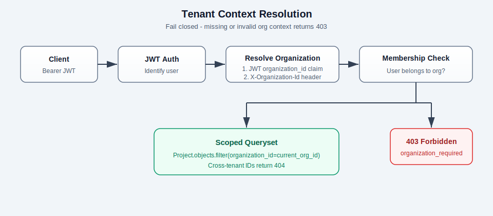
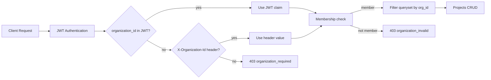

# django-saas-multitenant-api

[](https://github.com/SparkScribe/django-saas-multitenant-api/actions/workflows/ci.yml)
[](LICENSE)

Reference implementation for **B2B SaaS multi-tenancy in Django**: organizations as tenants, user memberships with roles, and **row-level data isolation** so each tenant only sees their own projects.

Built for portfolio and client proposals — demonstrates senior Django API design without exposing cross-tenant data.

## Features

- Custom email-based `User` model with UUID primary keys
- `Organization` and `Membership` models (`owner` / `member` roles)
- JWT authentication with optional `organization_id` claim (single-org users)
- Tenant context from JWT claim or `X-Organization-Id` header
- Organization-scoped Projects CRUD with `IsOrganizationMember` permission
- Mandatory tenant isolation test suite
- OpenAPI schema (Swagger UI + ReDoc) via drf-spectacular
- Docker Compose (PostgreSQL + Django) and GitHub Actions CI

## Tech stack

| Component | Choice |
|---|---|
| Django | 5.x |
| API | Django REST Framework + simplejwt |
| OpenAPI | drf-spectacular |
| Database | PostgreSQL |
| Tests | pytest-django |
| Runtime | Docker Compose |

## Quick start

```bash
git clone https://github.com/SparkScribe/django-saas-multitenant-api.git
cd django-saas-multitenant-api
cp .env.example .env
docker compose build web
docker compose up -d
```

API base URL: `http://localhost:8000/api/v1/`

| Resource | URL |
|---|---|
| Swagger UI | http://localhost:8000/api/docs/ |
| ReDoc | http://localhost:8000/api/redoc/ |
| OpenAPI schema | http://localhost:8000/api/schema/ |

If port `8000` is in use: `WEB_PORT=8001 docker compose up -d`

## API overview

Base path: `/api/v1`

### Auth

| Method | Path | Description |
|---|---|---|
| POST | `/auth/register/` | Create user; optionally create organization |
| POST | `/auth/token/` | Obtain JWT (includes `organization_id` for single-org users) |
| GET | `/auth/me/` | Current user and memberships |

### Organizations

| Method | Path | Description |
|---|---|---|
| GET | `/organizations/` | List organizations the user belongs to |
| POST | `/organizations/` | Create organization (user becomes owner) |

### Projects (tenant-scoped)

| Method | Path | Description |
|---|---|---|
| GET | `/projects/` | List projects in active organization |
| POST | `/projects/` | Create project in active organization |
| GET/PATCH/DELETE | `/projects/{id}/` | Retrieve/update/delete (404 if other org) |

**Tenant context:** send `Authorization: Bearer <token>`. If the user belongs to multiple organizations and the JWT has no `organization_id` claim, also send `X-Organization-Id: <uuid>`.

## Shared-schema tenancy

This project uses a **shared database, shared schema** pattern with a discriminator column (`organization_id`) on tenant-owned tables.


### Tradeoffs

| Advantage | Tradeoff |
|---|---|
| Simple migrations and ops — one schema to manage | Every query must filter by `organization_id` |
| Efficient for many small tenants | Risk of data leaks if filtering is missed |
| Standard Django ORM — no custom DB routing | Harder to offer per-tenant backup/restore |
| Fast to ship for early-stage B2B SaaS | Noisy-neighbor resource limits need app-level controls |

The codebase enforces isolation in **permissions + queryset filtering**, not by convention alone. Cross-tenant access returns **404** (not 403) for resource endpoints to avoid leaking existence of foreign IDs.

## Tenant context flow





**Precedence:** JWT `organization_id` claim → `X-Organization-Id` header → fail closed.

## When to upgrade to schema-per-tenant

Stay on shared-schema while tenant count is moderate and teams are small. Consider **schema-per-tenant** (or database-per-tenant) when enterprise customers require contractual data isolation, independent backup/restore SLAs, or regulatory boundaries that shared rows cannot satisfy. The migration path usually starts with optional dedicated schemas for premium tiers while keeping the same application code paths abstracted behind a tenant router.

## Testing

```bash
docker compose up -d db
docker compose run --rm --entrypoint "" web pytest
```

Critical isolation tests live in `tests/test_tenant_isolation.py` and must pass before shipping.

```bash
docker compose run --rm --entrypoint "" web pytest tests/test_tenant_isolation.py -v
```

Validate OpenAPI schema:

```bash
docker compose run --rm --entrypoint "" web python manage.py spectacular --validate
```

## Project structure

```
django-saas-multitenant-api/
├── apps/
│   ├── accounts/          # User model, auth endpoints, JWT
│   ├── organizations/     # Organization, Membership, tenant context
│   └── projects/          # Project model, permissions, scoped CRUD
├── config/                # Settings, URLs, OpenAPI, exceptions
├── docs/images/           # Architecture diagrams
├── tests/
│   ├── test_tenant_isolation.py   # mandatory cross-tenant tests
│   └── ...
├── docker-compose.yml
└── Dockerfile
```

## Related repositories

Other SparkScribe portfolio and starter projects:

| Repository | Description |
|---|---|
| [django-saas-multitenant-api](https://github.com/SparkScribe/django-saas-multitenant-api) | This project — B2B SaaS multi-tenancy |
| [django-rest-api-starter](https://github.com/SparkScribe/django-rest-api-starter) | Django REST API starter template |
| [fastapi-production-api-starter](https://github.com/SparkScribe/fastapi-production-api-starter) | FastAPI production API starter |
| [celery-task-pipeline](https://github.com/SparkScribe/celery-task-pipeline) | Celery background task pipeline |
| [rag-document-qa-api](https://github.com/SparkScribe/rag-document-qa-api) | RAG document Q&A API |

## License

MIT — see [LICENSE](LICENSE). Copyright (c) 2026 Ankit Vaghani / SparkScribe Technologies.
